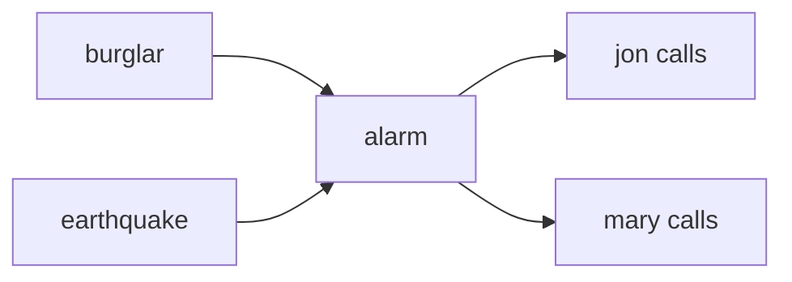

## Week 10

### Day 19 - 11.03.2025

#### Joint Probability Distribution
Given a bunch of random variables $P(x_1,x_2,...,x_D)$ = $P(x_1 \wedge x_2 \wedge ... \wedge x_D)$
> the random variables are boolean, discrete and finite

The conditional probability is not equal to the joint distribution... but its proportional to the value in the joint distn

$P(x_1=1|x_2=0,x_3=1)$ = $\frac{P(x_1=0,x_2=0,x_3=1)}{P(x_2=0,x_3=1)}$ \
$P(x_1=1|x_2=0,x_3=1) \space \propto \space \frac{1}{z} P(x_1=0,x_2=0,x_3=1)$

- $P(x_1=,x_2=,x_3=)$ - evidence/prior
- $P(x_1=)$ - marginal
- $P(x_1= | x_2=,x_3=)$ - conditional
- $x_1=? \space P(x_1| x_2,x_3)$ is maximum

Independence \
A and B are independent: iff P(A|B)=P(A) or P(A,B) = P(A)P(B) or P(B|A)=P(B)

Using this we reduce the size of the joint distn table... \
say P(T, Ca, W) \[8\] = P(T, Ca) P(W) \[4 + 2\] \
say P(T, Ca, catch, W)  = P(T, Ca, catch) P(W) \
P(catches|T, Cavity=True) = P(catches|cavity=true) \
this is called conditional independence 

> Chain rule in probability $P(A,B,C)$ = $P(A|BC)P(BC)$ = $P(A|BC)P(B|C)P(C)$

#### Bayesian Networks
Probabilistic Graphical model 

Can reason about unknown variables
- eplanation (diagonistic reasoning)
- prediction (causal reasoning)
- value of information

Its a directed acyclic graph... \
the modes are the random variables \
directed edges represent dependencies...

Ex: B(burglar), E(earthquake), A(burg alarm), J(jon calls), M(mary calls) \
burglar can set off the alarm \
earthquake can set off the alarm \
the alarm can cause jon to call \
the alarm can cause mary to call \

We can represent this in the bayesian network

then we have the tables that represent the probabilities... there can be multiple bayesian networks that can encode the same knowledge... 