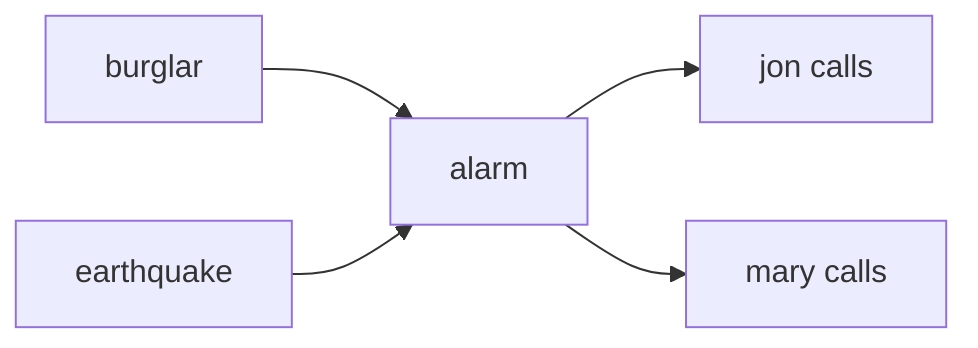
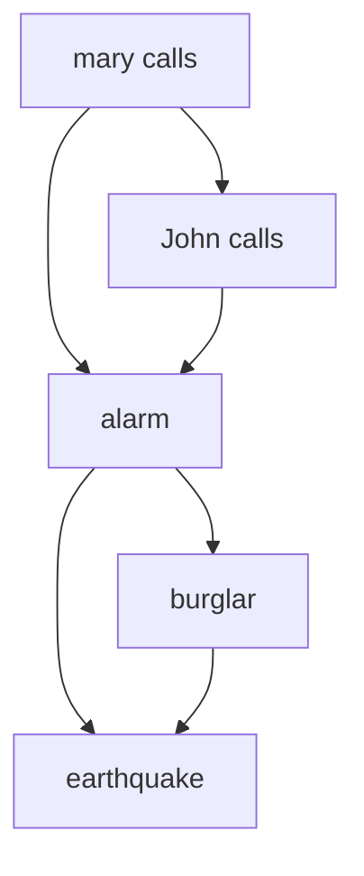

## Week 10

### Day 19 - 11.03.2025

#### Joint Probability Distribution
Given a bunch of random variables $P(x_1,x_2,...,x_D)$ = $P(x_1 \wedge x_2 \wedge ... \wedge x_D)$
> the random variables are boolean, discrete and finite

The conditional probability is not equal to the joint distribution... but its proportional to the value in the joint dist<sup>n</sup>

$P(x_1=1|x_2=0,x_3=1)$ = $\frac{P(x_1=0,x_2=0,x_3=1)}{P(x_2=0,x_3=1)}$ \
$P(x_1=1|x_2=0,x_3=1) \space \propto \space \frac{1}{z} P(x_1=0,x_2=0,x_3=1)$

- $P(x_1=,x_2=,x_3=)$ - evidence/prior
- $P(x_1=)$ - marginal
- $P(x_1= | x_2=,x_3=)$ - conditional
- $x_1=? \space P(x_1| x_2,x_3)$ is maximum

Independence \
A and B are independent: iff P(A|B)=P(A) or P(A,B) = P(A)P(B) or P(B|A)=P(B)

Using this we reduce the size of the joint dist<sup>n</sup> table... \
say P(T, Ca, W) \[8\] = P(T, Ca) P(W) \[4 + 2\] \
say P(T, Ca, catch, W)  = P(T, Ca, catch) P(W) \
P(catches|T, Cavity=True) = P(catches|cavity=true) \
this is called conditional independence 

> Chain rule in probability $P(A,B,C)$ = $P(A|BC)P(BC)$ = $P(A|BC)P(B|C)P(C)$


#### Bayesian (or belief) Networks
Probabilistic Graphical model 

Can reason about unknown variables
- eplanation (diagonistic reasoning)
- prediction (causal reasoning)
- value of information

Its a directed acyclic graph... \
the modes are the random variables \
directed edges represent dependencies...


Ex: B(burglar), E(earthquake), A(burg alarm), J(jon calls), M(mary calls) \
burglar can set off the alarm \
earthquake can set off the alarm \
the alarm can cause jon to call \
the alarm can cause mary to call \

We can represent this in the bayesian network


then we have the tables that represent the probabilities... there can be multiple bayesian networks that can encode the same knowledge... 

We have the tables $P(j|a)P(m|a)P(a| b, e)P(b)P(e)$ and this is a bayesian network for this cause

Okam razor something(?) - amongst the one that is simpler is preferred (?)

$P(x_1\dots x_N)$ = $\prod_{i=1}^{N}{P(x_i|Parents(x_i))}$

> The join distribution can be achieved by the product of the conditional distributions of the associated with it... and that is what the bayesian encodes(a specific factor of the random variables)...

### Day 20 - 13.03.2025

Global Semantics:
- define the full joint distribution as a product of the local conditional distributions
- $P(x_1\dots x_N)$ = $\prod_{i=1}^{N}{P(x_i|Parents(x_i))}$
- in the above example, say,
- $P(j \wedge m \wedge a \wedge \neg b \wedge \neg e)$ = $P(j|a)P(m|a)P(a|\neg b, \neg e)P(\neg b)P(\neg e)$
- And all these are already defined in the conditional probability tables

Bayesian Networks need not be causal 

**Constructing a Bayesian Network**
- a series of locally testable assertions of conditional independence guarantees global semantics (full joint)
- choose ordering of the variables - $x_1, \dots x_N$
- for i=1...N 
  - add the variable $x_1$ to the network
  - select parents form $x_1 \dots x_{i-1}$ such that $P(x_i|Parents(x_i))$ = $P(x_i | x_1, \dots , x_{i-1})$
- this choice guarantees global semantics \
    $P(x_1 \dots x_N)$ = $\prod_{i=1}^{N}{P(x_i|x_1, \dots x_{i-1})}$ = $\prod_{i=1}^{N}{P(x_i|Parents(x_i))}$


Let us consider the previous example and choose a different random variables


- we start with J and then we add M. 
- Now we add an edge form M to J. 
- Then we add A. 
- Now how do we represent $P(A|M,J)$ {$P(A), P(A|M), P(A|J), P(A|J,M)$} only the last one holds as if both of them call there will be a higher chances that the alarm has gone off. 
- Now we add B. Given that alarm is ringing we can have a probability that burglary has happened and doesnt matter if jon calls or mary calls we get no additional information about burglary happening. So we have an edge form A to B.
- Now we add E. Then check with all the variables that have been added \[$P(E|M,J,A,B)$\] . A is influencing and even B can also influence the probability.

So if we work in non causal direction will result in complex graphs.

And causal models and conditional independencies seems hardwired in humans

The number of edges increases and hence the number of the conditional probability table increases. \
In the prev example the size of the conditional probability table was less compared to the above example. \
Now here we write the table as $P(j,a,m,b,e)$ = $P(m)P(j|m)P(a|j,m)P(b|a)P(e|b,a)$


**Bayesian Networks : conditional independence**
- fundamental assumption \
  $P(x_1\dots x_N)$ = $\prod_{i=1}^{N}{P(x_i|Parents(x_i))}$
- beyond this there are other conditional independence assumptions

Ex:

$P(w,x,y,z)$ = $P(w)P(x|w)P(y|x)P(z|y)$ \
Now are x and z independent??
> defs of independence are : $P(x,z)$ = $P(x)P(z)$ , $P(x|z)$ = $P(x)$ , $P(z|x)$ = $P(z)$

We will go through some algorithms to deseperate and solve them.

*D - Seperation*
- causal chain \
    We consider the causal chain (consider the cahin $x \rarr y \rarr z$)
    - x - transfer monery, y- non zero balance , z - withdraw money 
    - is it gaurenteed that x is independent of z? (no... proof by counter example)
    - We can show $P(x,z) \not = P(x)P(z)$ 
    - Is it gaurenteed that x is independent of z given Y??
    - we need to check for $P(z|x,y) = P(z|y)$
    - $P(z|x,y) = \frac{P(x,y,z)}{P(x,y)}$
    - $P(x,y,z) = P(x)P(y|x)P(z|y)$
    - $P(x,y) = \sum_zP(x,y,z) = P(x,y,z)+P(x, \neg y, z)+P(x)P(y)$
    - Evidence along the chain 'blocks' the relation
- common cause 
  - x - thin attendence, Y- project is due, z - students are busy
  - 
  ```mermaid
        graph TD
            Y --> X 
            Y --> Z 
  ```
  - is it gaurenteed that x is independent of z $P(z|x) = P(z)$? (no.... proof by counter example)
  - say $P(y)=0.7, P(x|y)=1,P(\neg x, \neg y)=1, P(z,y)=1, P(\neg z, \neg y)=1$
  - $P(x,z) = \sum_zP(x,y,z)=0.7$ and $P(x)= \sum_{y,z}P(x,y,z)=0.7$ , $P(z)= \sum_{x,y}P(x,y,z)=0.7$

