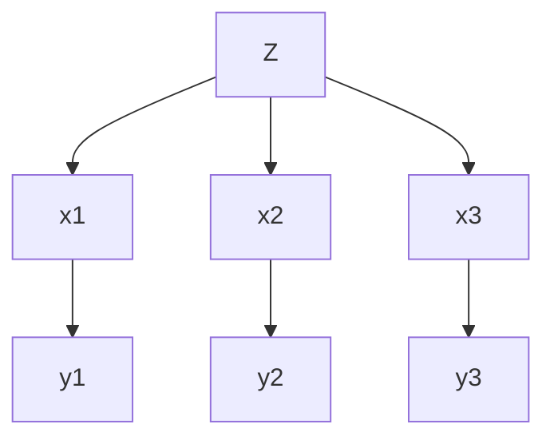

## Week 11

### Day 21 - 18.03.2025

_D Seperation_
- causal chain
- common cause
  - observing the clause blocks the infuluence fo the cause
- common effect
  - x-road repair, y-cricket match, z-traffic
  -  
    ```mermaid
    graph TD
        X-->Z
        Y-->Z
    ```
  - $P(x,y,z)=P(x)P(y)P(z|x,y)$
  - can we show x is independent of y? So without observing z, the causes become independent...
  - $P(x|y)=\frac{P(x,y)}{P(z)}$
  - $P(x,y)=P(x,y,z)+P(x,y, \neg z)=P(x)P(y)$
  - This is different form the other cases
  - Observing an effect activates influence between the possible causes
- Active/Inactive Paths
  - A path is active if each triplet in the path is active - dependencies between nodes
    - active paths
      ```mermaid
      graph LR
          X-->Y
          Y-->Z
      ```
      ```mermaid
      graph TD
          y-->z
          y-->x
      ```
      ```mermaid
         graph TD 
            X-->Z(Z')
            Y-->Z(Z')
      ```


Example:
- Is X independent of Y in the below example
  ```mermaid
     graph TD
         X-->Z
         Y-->Z
         Z-->z'
    ```
- here z is not being observed and hence x is independent of Y
- x and y are not conditionally independent given z
- similarly x and y are not conditionally independent given z'


Example 2:
- See below
  ```mermaid
     graph TD
         a-->b
         b-->c
         b-->e
         e-->e'
         d-->e
   ```
- C independent of D? No
- A independent of E' given E. yes... because b is inactive
- A independent of D. ($A \rarr B \rarr E \larr D$)... here the common effect triplet(BED) is inactive as e is not being observed.
- A and D independent given E. No
- A and D are independent given B,E
- The conditional independence will how even if we were to represent the smae conditions with a different bayesian network as we are ensuring that the bayesian network follows the global semantics are maintained.


Conditional Independence in BNs - Markov Blanket \
?? \
Idk th this is


Influence by enumeration
- We want to estimate - $P(Q|e_1,\dots , e_k)$
- step 1,2,3
- slightly intelligent way to sum out variables from the join without actually constructing its explicit reprresentation.


Evalustion Tree
- recursive depth first search... but there will be redudancies in the evalustion tree made by vanilla enumeration


Variable Elimination

Factor zoo...
- Factor Zoo I
  - joint distn P(X,Y)... sums to 1
  - Selected joint P(x,Y)... entries P(x,y) for fixed x all y, sums upto P(x)
- Factor Zoo II
  - Single Conditional... P(Y|x)... entries P(y|x) for fixed x, all y... sums to 1
  - Family of conditionals... P(Y|X)... entries of P(y|x) for all x, for all y... sums to |X| cardinality of rv X
- Factor Zoo III
  - Specified family... P(y|X)... sums to who knows


Example: Traffic Domain
- Random Variables
  - R: raining
  - T: traffic
  - L: latfe for flight
  - 
- Inference by enumeration - Procedural outline
  - procedure tracks objects called factors
  - inital factors are local CPTs (one per node)
  - any known values are selected


Operation 1 - Join factors (similar to a dbms join) \
Operation 2 - Eliminate

Marginilizing Early (=Variable Elimination)
- $R \rarr T \rarr L$
- Join on r 
- eliminate r
- join on t
- eliminate t


### Day 22 - 20.03.2025

Variable Elemination \
The variables that are not a part of the query or if they are not a part of the evidence

Evidence I:
- If evidence, start with factors that select that evidence
  -  No evidence uses these initial factors: $P(R)P(T|R)P(L|T)$
- Conpute $P(L|r)$, the inintal factors become $P(+r) P(T|+r)P(L|T)$... r is observed 

Evidence II:
- result will bea selected joijnt of quey and evidence


General Variable Elimination:
- Query : $P(Q|e_1 \dots , e_k)$
- Start with the inital factors
  - Local CPTs (but instantiated by evidence)
- While there are still hidden variables (not Q or evidence):
  - pick a hidden variable H (in arbitrary order)
  - join all factors mentioning H 
  - eliminate (sum out) H
- Join all the reamining factors and normalize
- Once we normalize we end up with the answer for the query
- And we get the exact value using variable Elimination

Example:


$P(z,x_1,x_2,x_3,y_1,y_2,y_3)=P(z)P(y_1|x_1)P(y_2|x_2)P(y_3|x_3)P(x_1|z)P(x_2|z)P(x_3|z)$

For the below query: \
$P(x_3|y_1,y_2,y_3), Q={x_3}, E={y_1,y_2, y_3}, H={z,x_1,x_2}$
- Now first we try to eliminate Z
  - $P(z)P(x_1|z)P(x_2|z)P(x_3|z)$
  - what will we end by performing this join??
  - $P(x_1|z)$ will be the join distribution $P(x_1,z)$ now if we multiply with $P(x_2|z)$ we end up with join distribution on $P(z, x_1, x_3)$ ...
  - so we end up with join distribution $P(z, x_1,x_2,x_3)$ and there will be 16 entries
  - Now if we sum it out we end uo with $P(x_1,x_2,x_3)$
- Now we eliminate x1:
  - $P(x_1,x_2,x_3)P(y_1|x_1)$
  - and we end up with $P(x_2,x_3,y_1)$
- Now eliminate x2: we end up with 


Now if we go in the order $H={x_1,x_2,z}$
- eliminate x1: we end up with the table $f_{x_1}(y_1|z)$
- eliminate x2: we get the factor table $f_{x_2}(y_2|z)$
- eliminate z: we get $f_z(y_1,y_2,y_3,x_3)$
- and here the maximum table size is 2 and previously it is 8

Thus the order of elimination matters...

And determining the optimal order is and np-hard problem and there might not exist an optimal oredr in itself

Thus exact inference in bayesian network is np-hard

So we approximate

__Approximate Inference: Sampling__
- Sampling: without replacement(the distn changes with each sample is picked) or with replacement(samples are obtained from the same distn and the samples are independent of each other, i.e., the samples are iid)
- we condseder the interval $[0,1]$ and divide it proportionally to the smaples... the area that we look at 

Prior Sampling...(ignores the evidence)

Rejection Sampling...(discard the sample that is inconsistent with the evidence we discard it) \
It is still consistent even though we may discard a lot of samples

Importance Sampling... We associate a weight to a sample

The last sampling alg is Markov Chain Monte Carlo sampling which is very popular...


